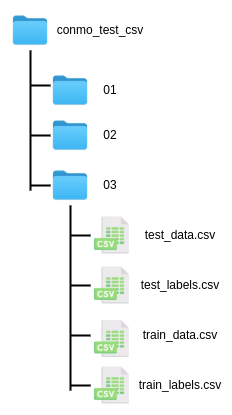

.. _howto:

=================
Development guide
=================

Possibilities of Conmo
======================

Conmo framework has been designed to be user-friendly for recreating and evaluating experiments, but also for adding new algorithms, datasets, preprocesses, etc.
This section explains the possibilities offered by this framework when implementing new submodules. We believe that using and contributing to Conmo can benefit all types of users, as well as helping to standardise comparisons between results from different scientific articles.

If you still have doubts about the implementation of new components to the framework, you can take a look at the API reference, examples or contact the developers.

Add a new dataset
=================
.. currentmodule:: conmo.datasets.dataset

:class:`Dataset` is the core abstract class for every dataset in Conmo and contains basic methods and attributes that are common for all datasets.
At the same time, two classes depend on it and differ acording to where the original data is stored:

* :class:`LocalDataset`: 
    Is the abstract class in charge of handling datasets that are stored locally on the computer where Conmo will be running. The main method of this class is :meth:`LocalDataset.load`. It's in charge of parsing the original dataset files to Conmo's format and moving them to the data folder. It's an abstract method wich needs to be implemented in every local dataset.
    There is also an abstract method :meth:`feed_pipeline` to copy selected data to pipeline step folder.
* :class:`RemoteDataset`:
    In case the dataset to be implemented is originally located on a web server, a Git repository or other remote hosting, the RemoteDataset class is available in Conmo. Among all its methos, it's remarkable the :meth:`RemoteDataset.download` to download the dataset from a remote URL.

For adding a new local dataset to the framework you need to create a new class that inherits from :class:`LocalDataset` and override the following methods:

* :meth:`LocalDataset.__init__`:
    This is the constructor of the class. Here you can call the constructor of the father class to assign the path to thw original dataset. Here you can also define some attributes of the class, like the label's columns names, feature's names.
    Also you can assign the subdataset that you want to instanciate.

* :meth:`LocalDataset.dataset_files`: 
    This method must return a list with all the files (data and labels) that compounds the dataset.

* :meth:`LocalDataset.load`: 
    This method must convert all raw dataset files to the appropriate format for Conmo's pipeline. For each of the datasets, first read and load the data and labels into Pandas dataframes, then concatenate them (e.g. train data and test data will be concatenated in one dataframe, the same for test) and finally save them in parquet format. 
    Some considerations to take into account: 
        * Data and labels dataframes will have at least a multi-index for sequence and time. You can consult more information in the `Pandas documentation <https://pandas.pydata.org/pandas-docs/stable/user_guide/advanced.html>`_.
        * The columns index must start at 1.
        * If there dataset is only splittered into train and test, then there will be 2 sequences, one per set.
        * In case the dataset is a time series with sequences, train sequences go after the test sequences.

* :meth:`LocalDataset.feed_pipeline`: 
    This method is used to copy the dataset from *data* directory to the directory *Dataset* of the experiment.

* :meth:`LocalDataset.sklearn_predefined_split`: 
    If you plan to use the Predefined Split from the Sklearn library your class must implement this method. It must generate an array of indexes of same length as sequences to be used with PredefinedSplit. The index must start at 0.

For adding a new remote dataset to the framework the procedure is almost identical to a local dataset. You need to create a new class that inherits from :class:`RemoteDataset` and override the following methods:

* :meth:`RemoteDataset.__init__`:
    This is the constructor of the class. Here you can call the constructor of the father class to assign the path to thw original dataset. You can also define some attributes of the class, like the label's columns names, features's names.
    , file format, URL and checksum. Also you can assign the subdataset that you want to instanciate.

* :meth:`RemoteDataset.dataset_files`: 
    This method must return a list with all the files (data and labels) that compounds the dataset.

* :meth:`RemoteDataset.parse_to_package`: 
    Almost identical to :meth:`LocalDataset.load`.

* :meth:`RemoteDataset.feed_pipeline`: 
    This method is used to pass the dataset from *data* directory to the directory *Dataset* of the experiment.

* :meth:`RemoteDataset.sklearn_predefined_split`: 
    If you plan to use the Predefined Split from the Sklearn library your class must implement this method. It must generate an array of indexes of same length as sequences to be used with PredefinedSplit. The index must start at 0.

Add a new algorithm
===================
.. currentmodule:: conmo.algorithms.algorithm

Conmo provides a core abstract class named :class:`Algorithm` that contains the basic methods for the operation of any algorithm, mainly training with a training set, performing a prediction over test, loading and saving input and output data.
Depending on the type of anomaly detection algorithm to be implemented, there are two classes depending on the operation of the method:
 
* :class:`AnomalyDetectionThresholdBasedAlgorithm`:
    If your algorithm needs to calculate a threshold to determine which samples are anomalous it must inherit from this class. For example: PCA Mahalanobis.

* :class:`AnomalyDetectionClassBasedAlgorithm`:
    If your algorithm identifies by classes the normal sequences from the anomalous ones, it must inherit from this class. For example: One Class SVM.

* :class:`PretrainedAlgorithm`:
    Check out this class if your algorithm was pre-trained prior to running an experiment, i.e. it is not necessary to train it during the experiment. It is required to be able to define the path where the pre-trained model is stored on disk.

For adding a new algorithm to the framework you need to create a new class that inherits from one of these classes depending of the type of the algorithm and override the following methods:

* :meth:`__init__`:
    Constructor of the class. Here you can initialize all the hyperparameters needed for the algorithm. Also you can fix random seeds of Tensorflow, Numpy, etc here for reproducibilty purposes.

* :meth:`fit_predict`: 
    Method responsible of building, training the model with the training data and testing it with the test set. In case your algorithm is threshold-based, it will be necessary to verify that each output in the test set exceeds that threshold to determine that it is anomalous. In the case of a class-based algorithm, depending on the output, it will be necessary to identify whether it is an outlier or an anomaly. Finally, the output dataframe has to be generated with the labels by sequence or by time.

* :meth:`find_anomaly_threshold`:
    In case the algorithm is threshold based, the threshold selection can be customised overriding this method.

You can add auxiliary methods for model construction, weights loading, etc. in case the model structure is very complex.

Add a new splitter
==================
.. currentmodule:: conmo.splitters.splitter
The core abstract class is :class:`Splitter` and provides some methods to load inputs, save outputs and check it the input was already splittered.
For adding a new splitter you must create a new class that inherits from :class:`Splitter` and implements the method :meth:`Transform`.
If the splitters you want to implement is available on Scikit-Learn library, we provide the class :class:`SklearnSplitter` and indicating the name of the splitter to be used will allow you to use it in your experiment.

Add a new preprocess
====================
.. currentmodule:: conmo.preprocess.preprocess

:class:`ExtendedPreprocess` Class is used for the implementation of new preprocessings in the pipeline. :class:`ExtendedPreprocess` inherits from the core abstract class :class:`Preprocess` and provides a constructor in order to define which parts of the dataset will be modified by the preprocessing: labels, data, test or train. Also permits to apply the preprocess to a specyfic set of columns.
To define a new preprocess you only need to create a new class than inherits from :class:`ExtendedPreprocess` and implements the method :meth:`Transform`, where the preprocessing will be applied to th datset.
If the preprocess you want to implement is available on Sklearn library, we provide the class :class:`SklearnPreprocess` and indicating the name of the preprocessing to be used will allow you to use it in your experiment.
In order to make things easier, the :class:`CustomPreprocess` class is available to implement a preprocessing tool from a function, which will be passed as an argument in the constructor. For additional information you can have a look at the example :ref:`nasa_cmapps.py <examples>`.

Add a new metric
================
.. currentmodule:: conmo.metrics.metric

You can add a new metric by creating a new class that inherits from the abstract class :class:`Metric`.

The only method you have to take care is:

* :meth:`calculate`:
    Based on the outputs of the algorithms and the number of folds, the results are computed and the metrics dataframe is created and stored.

CSV dataset import example
==========================

A very common use case that Conmo users may encounter is to add a new dataset that is stored in CSV format. For this case we have developed this small guide, which includes a template as an example.
The dataset is stored locally so it will inherit from LocalDataset. It contains three subdatasets stored in different directories, in all of them there are CSV files for data and labels, both for train and test:

The template:

.. code-block:: python
        :linenos:

        import os
        import shutil
        from os import path
        from typing import Iterable

        import pandas as pd

        from conmo.conf import File, Index, Label
        from conmo.datasets.dataset import LocalDataset

        class CSV_Dataset(LocalDataset):
            # ------------------------------------------------------------------------------------ #
            # Define constants here ...                                                            #
            # ------------------------------------------------------------------------------------ #
            #
            EX_CONST = 22
            EX_SUBDATASETS = ['01', '02', '03']
            EX_COL_NAMES = ['A', 'B', 'C']

            # ------------------------------------------------------------------------------------ #
            # Constructor of the class                                                             #
            # Call super class constructor to pass path where the raw dataset is stored            #
            # Here you can initialize attributes with passed values                                #
            # and the specific subbdataset to be used when instantiating                           #
            # ------------------------------------------------------------------------------------ #
            #

            def __init__(self, path: str, subdataset: str) -> None:
                super().__init__(path)
                self.path = path
                self.subdataset = subdataset

            # ------------------------------------------------------------------------------------ #
            # Loads the original CSV files to Pandas dataframes,                                   #
            # give them the appropriate format and finally save them to disk.                      #
            # ------------------------------------------------------------------------------------ #
            #
            def load(self) -> None:
                # SOME CONSIDERATIONS:
                # - You can use Pandas utility read_csv()
                # - Index must start at 1, not 0
                # - Generate only 1 file for data and other for labels
                # - Necessary a multi-index with two levels, an outer level of sequences and an inner level of sequences.
                # - If there is both train and test data, each of them shall form a sequence.

                # Iterate over files in the directory where the local original data is stored
                for subdataset in os.listdir(self.path):
                    # ------------------------------------------------------------------------------------ #
                    # Read data CSV and generate dataframe
                    train_data = pd.read_csv(path.join(
                        self.path, subdataset, 'train_data.csv'), sep=',', header=None, names=self.EX_COL_NAMES)
                    test_data = pd.read_csv(path.join(
                        self.path, subdataset, 'test_data.csv'), sep=',', header=None, names=self.EX_COL_NAMES)

                    # Reset index for starting from 1 (Conmos format)
                    train_data.index += 1
                    test_data.index += 1

                    # Concatenate train and test data into 1 dataframe. (Always first train data)
                    # Time is and old name and needs to be upgraded but the purpose is the same as a normal Index
                    data = pd.concat([train_data, test_data], keys=[
                                    1, 2], names=[Index.SEQUENCE, Index.TIME])

                    # Sort index after concatenate
                    data.sort_index(inplace=True)

                    # ------------------------------------------------------------------------------------ #
                    # Read labels CSV and generate dataframe
                    train_labels = pd.read_csv(path.join(
                        self.path, subdataset, 'train_labels.csv'), sep=',', header=None, names=[Label.ANOMALY])
                    test_labels = pd.read_csv(path.join(
                        self.path, subdataset, 'train_labels.csv'), sep=',', header=None, names=[Label.ANOMALY])

                    # Reset index for starting from 1 (Conmo's format)
                    train_labels.index += 1
                    test_labels.index += 1

                    # Concatenate train and test data into 1 dataframe. (Always first train data)
                    # Time is and old name and needs to be upgrade but the purpose is the same as a normal Index
                    labels = pd.concat([train_labels, test_labels], keys=[
                                    1, 2], names=[Index.SEQUENCE, Index.TIME])

                    # Sort index after concatenate
                    labels.sort_index(inplace=True)

                    # ------------------------------------------------------------------------------------ #
                    # Finally save dataframes to disk in /home/{username}/conmo/data/... in parquet format
                    data.to_parquet(path.join(self.dataset_dir, '{}_{}'.format(
                        subdataset, File.DATA)), compression='gzip', index=True)
                    labels.to_parquet(path.join(self.dataset_dir, '{}_{}'.format(
                        subdataset, File.LABELS)), compression='gzip', index=True)

            # ------------------------------------------------------------------------------------ #
            # Method for adding to a list the different files that                                 #
            # belong to the dataset                                                                #
            # Usually iterate over the subdatasets                                                 #
            # ------------------------------------------------------------------------------------ #
            #
            def dataset_files(self) -> Iterable:
                files = []
                for key in self.EX_SUBDATASETS:
                    # Data
                    files.append(path.join(self.dataset_dir,
                                "{}_{}".format(key, File.DATA)))
                    # Labels
                    files.append(path.join(self.dataset_dir,
                                "{}_{}".format(key, File.LABELS)))
                return files

            # ------------------------------------------------------------------------------------ #
            # Method for adding to pipeline step folder                                            #
            # Move from dataset_dir to out_dir data and labels                                     #
            # ------------------------------------------------------------------------------------ #
            #
            def feed_pipeline(self, out_dir: str) -> None:
                # Data
                shutil.copy(path.join(self.dataset_dir, "{}_{}".format(
                    self.subdataset, File.DATA)), path.join(out_dir, File.DATA))
                # Labels
                shutil.copy(path.join(self.dataset_dir, "{}_{}".format(
                    self.subdataset, File.LABELS)), path.join(out_dir, File.LABELS))

            # ------------------------------------------------------------------------------------ #
            # OPTIONAL: Only implement if you plan to use                                          #
            # PredefinedSplit method of Scikit-Learn library.                                      #
            # Returns indexes of sequences:                                                        #
            #   -1 -> if the sequence will be excluded on test set                                 #
            #    0 -> Test set                                                                     #
            # ------------------------------------------------------------------------------------ #
            #
            def sklearn_predefined_split(self) -> Iterable[int]:
                return [-1, 0]

Once the class is ready, the respective import has to be added to the __init__ file and the class name to the __all__ list as follows:

.. code-block:: python
        :linenos:
    
        from conmo.datasets.mars_science_laboratory_mission import MarsScienceLaboratoryMission
        from conmo.datasets.nasa_turbofan_degradation import NASATurbofanDegradation
        from conmo.datasets.server_machine_dataset import ServerMachineDataset
        from conmo.datasets.soil_moisture_active_passive_satellite import SoilMoistureActivePassiveSatellite
        from conmo.datasets.batteries_degradation import BatteriesDataset
        #----------------------------------------
        # Add import to __init__ file of the module
        from conmo.datasets.csv_dataset import CSV_Dataset
        #----------------------------------------

        __all__ = [
            'NASATurbofanDegradation'
            'ServerMachineDataset'
            'SoilMoistureActivePassiveSatellite'
            'MarsScienceLaboratory'
            'BatteriesDataset'
            #----------------------------------------
            # Add class name here
            'CSV_Dataset'
            #----------------------------------------
        ]

Finally the dataset is ready to be used in an experiment:

.. code-block:: python
        :linenos:

        import os
        import sys

        # Add package to path (Uncomment only in case you have downloaded Conmo from github repository)
        sys.path.append(os.path.abspath(os.path.join(os.path.dirname(__file__), '..')))

        from sklearn.preprocessing import MinMaxScaler

        from conmo.experiment import Experiment, Pipeline
        from conmo.algorithms import OneClassSVM
        from conmo.datasets import CSV_Dataset
        from conmo.metrics import Accuracy
        from conmo.preprocesses import SklearnPreprocess
        from conmo.splitters import SklearnSplitter
        from sklearn.model_selection import PredefinedSplit
        from sklearn.preprocessing import MinMaxScaler

        # Pipeline definition
        dataset = CSV_Dataset('/home/lucas/conmo_test_csv', '01')
        splitter = SklearnSplitter(splitter=PredefinedSplit(dataset.sklearn_predefined_split()))
        preprocesses = [
            SklearnPreprocess(to_data=True, to_labels=False,
                            test_set=True, preprocess=MinMaxScaler()),
        ]
        algorithms = [
            OneClassSVM()
        ]
        metrics = [
            Accuracy()
        ]
        pipeline = Pipeline(dataset, splitter, preprocesses, algorithms, metrics)

        # Experiment definition and launch
        experiment = Experiment([pipeline], [])
        experiment.launch()

Coding conventions
==================
The following tools are used to ensure that new software being added to Conmo meets minimum quality and format requirements:

* **Autopep8**: We use this tool to automatically format our Python code to conform to the PEP 8 style guide. It uses the pycodestyle utility to determine what parts of the code needs to be formatted.
* **Isort**: We use this library to sort imports alphabetically, and automatically separated into sections and by type.
* **Pytest**: To ensure that the output format of a new designed step (algorithm, dataset, etc) is correct we use Pytest framework to testing the new code. This tetsing frameworks is easy to use and supoort complex testing at the same. At the moment we are finishing the implementation of tests on the existing code, so there could be parts that may be modified in future updates.

