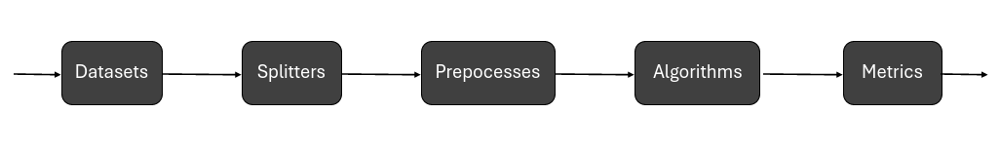

.. _quickstart:

================
Quickstart Guide
================

Requirements
============

**Conmo** was developed under Python version 3.7.11 so it should work with similar or more recent versions. However, we cannot claim this to be true, so we recommend using the same version.
To be able to use **Conmo** you need to have installed a Python interpreter and the following libraries on your computer:

    - `Numpy <https://numpy.org/>`_
    - `Pandas <https://pandas.pydata.org/>`_
    - `Tensorflow <https://www.tensorflow.org/>`_
    - `Scikit-Learn <https://scikit-learn.org/stable/>`_
    - `Scipy <https://scipy.org/>`_
    - `Requests <https://docs.python-requests.org/>`_
    - `Pyarrow <https://arrow.apache.org/docs/python/index.html>`_

If you want to make a contribution by modifying code and documentation you need to include these libraries as well:

    - `Sphinx  <https://www.sphinx-doc.org/en/master/>`_
    - `Sphinx-rtd-theme <https://github.com/readthedocs/sphinx_rtd_theme>`_
    - `Isort <https://github.com/PyCQA/isort>`_
    - `Autopep8 <https://github.com/hhatto/autopep8>`_

We suggest to create a new virtual enviroment using the Conda package manager and install there all dependences.

Installation
============

The fastest way to get started with Conmo is to install it via the pip command.

.. code-block:: bash
    
    pip install conmo

And then you will be able to open a Python interpreter and try running.

.. code-block:: bash

    import conmo

Some TensorFlow warnings might come up if your computer doesn't have installed a GPU, although that's not a problem for running Conmo.

You can also install Conmo manually downloading the source code from the Github repository.

.. code-block:: bash

    git clone https://github.com/MyM-Uniovi/conmo.git
    cd conmo

Then if you haven't prepared manually a conda enviroment, you can execute the shell-script ``install_conmo_conda.sh`` to install all the dependences and create a Conda enviroment with Python 3.7.

.. code-block:: bash

    cd scripts
    ./install_conmo_conda.sh conda_env_name

If your operating system is not Unix-like and you are using Windows 10/11 OS you can create the Conda enviroment manually or use the Windows Subsytem for Linux (WSL) tool.
For more information about its installation, please refer to `Microsoft's official documentation. <https://docs.microsoft.com/en-us/windows/wsl/install>`_.

To check if the Conda enviroment is activated you should see a ``(conda_env_name)`` in your command line. If it is not activated, then you can activated it using:

.. code-block:: bash

    conda activate conda_env_name

Overview
========

The experiments in Conmo have a pipeline-based architecture.
A pipeline consists of a chain of processes connected in such a way that the output of each element of the chain is the input of the next, thus creating a data flow. Each of these processes represents one of the typical generic steps in Machine Learning experiments:

Datasets
    Defines the dataset used in the experiment which will be the starting data of the chain. Here the dataset will be loaded and parsed to a standard format.
Splitters
    Typically in Machine Learning problems the data has to be splitted into train data and test data. Also here you can apply Cross-Validation techniques.
Preprocesses
    Defines the sequence of preprocesses to be applied over the dataset to manipulate the data before any algorithm is executed.
Algorithms
    Defines the different algorithms which will be executed over the same input data stream (as a result of the previous stage). It can be one or several.
Metrics
    Defines the different metrics that can be used to evaluate the results obtained from the algorithms.

Further details and documentation about modules, functions and parameters are provided in the :ref:`API Reference <api>`.

Running an experiment
=====================

Here is a brief example on how to use the different comno modules to reproduce an experiment.
In this case with the predefined splitter of the Server Machine Dataset, Sklearn's MinMaxScaler as preprocessing, PCAMahalanobis as algorithm and accuracy as metric.

1. Import the module if it hasn't been imported yet and other dependences:

    .. code-block:: python
        :linenos:
        
        from sklearn.preprocessing import MinMaxScaler

        from conmo import Experiment, Pipeline
        from conmo.algorithms import PCAMahalanobis
        from conmo.datasets import ServerMachineDataset
        from conmo.metrics import Accuracy
        from conmo.preprocesses import SklearnPreprocess
        from conmo.splitters import SklearnSplitter
        from sklearn.model_selection import PredefinedSplit
        from sklearn.preprocessing import MinMaxScaler

2. Configure the different stages of the pipeline:

    .. code-block:: python
        :linenos:

        dataset = ServerMachineDataset('1-01')
        splitter = SklearnSplitter(splitter=PredefinedSplit(dataset.sklearn_predefined_split()))
        preprocesses = [
            SklearnPreprocess(to_data=True, to_labels=False,
                            test_set=True, preprocess=MinMaxScaler()),
        ]
        algorithms = [
            PCAMahalanobis()
        ]
        metrics = [
            Accuracy()
        ]
        pipeline = Pipeline(dataset, splitter, preprocesses, algorithms, metrics)

3. Create an experiment with the configured pipeline. The first parameter is a list of the pipelines that will be included in the experiment
   It can be one or more. The second parameter is for statistical testing between results, but this part is still under development and therefore
   it cannot be used:

    .. code-block:: python
        :linenos:

        experiment = Experiment([pipeline], [])

4. Start running the experiment by calling ``launch()`` method:

    .. code-block:: python
        :linenos:

        experiment.launch()

5. As a result of the execution of the experiment a specific folder structure will be created in ``~/conmo``:

``/data``
    This directory contains the various datasets that have already been imported (downloaded and parsed) and are therefore already available for use. 
    *They are stored in parquet format for better compression*. For each of the subdatasets included in each dataset, there will be a data file and a labels file.
``/experiments``
    This directory contains all the executions of an experiment in Conmo in chronological order. Each directory corresponds to an experiment and has in its name a 
    timestamp with the time and day when this experiment was run. Within each experiment directory there will be another one for each pipeline, and within this one 
    there will be as many directories as the number of steps each pipeline has been determined to contain These folders contain the input and output data used by 
    each step of the pipeline. They are also stored in parquet format, in the same way as the datasets in the ``/data`` folder.
